# 🧋 Milk Tea E-commerce - Spring Boot REST API

> E-commerce backend for a milk tea shop, built with **Spring Boot 3.3.4**, **PostgreSQL 16** and **Docker**.  
> Provides REST APIs for both the customer portal and the admin dashboard.

[](https://spring.io/projects/spring-boot)
[](https://openjdk.java.net/projects/jdk/17/)
[](https://www.postgresql.org/)
[](https://docs.docker.com/compose/)

> **E-commerce platform for milk tea business**

## 🎯 Project Overview

This e-commerce platform demonstrates modern Spring Boot development practices with a  
**Package by Feature** architecture, providing a complete business solution for milk tea stores, including both the customer shopping experience and administrative management tools.

## 🌐 Live Demo & Frontend

- **Live site**: http://57.180.46.117
- **Frontend repository**: https://github.com/Shinx99/milk-tea-ecommerce-fe
- **Backend repository**: https://github.com/Shinx99/milk-tea-ecommerce-springmvc

### 🏗️ Architecture Highlights

- **Package by Feature**: Organized by business capabilities rather than technical layers.
- **Spring Boot REST API**: Clean REST API architecture.
- **Domain-Driven Design mindset**: Clear separation of business concerns.
- **Docker-first development**: Containerized for consistent environments.

---

## 🚀 Quick Start

Requirements:

- **Docker Desktop or Docker Engine**
- **Java 17+** (optional, only if you want to run without Docker)

### 1. Setup

```bash
 git clone https://github.com/Shinx99/milk-tea-ecommerce-springmvc.git
 cd milk-tea-ecommerce-springmvc 
 cp .env.example .env
 ```
Update values in .env if needed (DB, JWT, mail, VNPay, ...)
 ```bash
 docker compose up --build
```

- App: `http://localhost:8080`
- PostgreSQL runs in a container, Flyway automatically applies all migrations and sample data.

### Account demo:
```bash
Admin:
email: admin@milktea.local
password: Admin#123

Customer:
email: customer1@milktea.local
password: Customer#1
```


---

## ✨ Features

### 🛍️ Customer Portal

- **Product catalog**: Browse milk tea products by category, search and view details.
- **Shopping cart**: Add, update and remove items before checkout.
- **Order & payment**: Place orders with COD / online payment and view order history.
- **User account**: Registration, login and profile management (customer info, shipping addresses).
- **Email notifications**: Send order confirmation / invoice and important updates to customers.

### 🔧 Admin Dashboard

- **Category management**: Full CRUD for product categories (create, update, delete, search by name).
- **Product management**: CRUD for products, assign products to categories, manage product images.
- **Order management**: View all orders and update order status (pending, shipping, completed, cancelled).
- **Customer & address management**: View customer list and their shipping addresses to support order handling.

### 🔒 Security

- **JWT-based authentication**: Stateless authentication using JSON Web Tokens for all protected API endpoints.
- **Role-based access control**: Clear separation between CUSTOMER and ADMIN (e.g. `/api/admin/**` only for ADMIN).
- **Endpoint-level rules**: Public endpoints for auth and product browsing, authenticated access for cart/orders/customers, admin-only routes for management.
- **CORS configuration**: Allow frontend clients (e.g. `http://localhost:5173`) to call the APIs safely.
- **Password hashing**: User passwords are stored using BCrypt.

---

## 🛠️ Tech Stack

- **Backend**: Spring Boot 3.3.4, REST API, Spring Security with JWT.
- **Persistence**: Spring Data JPA, Hibernate.
- **Database**: PostgreSQL 16 (main database, managed via Flyway migrations).
- **Containerization**: Docker & Docker Compose (app + PostgreSQL; Redis is prepared for future caching).
- **Build Tool**: Maven 3.9.6.
- **Language**: Java 17 (OpenJDK).

---

## 📁 Project Structure (Package by Feature)


```bash
📦 src/
├── main/
│ ├── java/com.asm.ecommerce
│ │ ├── 📂 auth/ # authentication & authorization
│ │ ├── 📂 cart/ # shopping cart
│ │ ├── 📂 chatbox/ # chat / support module (WIP)
│ │ ├── 📂 customer/ # customer profiles & shipping addresses
│ │ ├── 📂 notification/ # email / notifications
│ │ ├── 📂 order/ # orders
│ │ ├── 📂 payment/ # payments (COD, VNPay, ...)
│ │ ├── 📂 product/ # products, categories, images
│ │ ├── 📂 shared/ # common config, exception, util, DTOs
│ │ └── 📂 statistics/ # admin statistics APIs
│ │
│ └── resources
│     ├── 📂 db.migration/ # Flyway SQL scripts + sample data
│     └── application.yml
│
└── test/
    └── java/com.asm.ecommerce/shared/util
        ├── DateTimeUtilTest.java
        ├── StringUtilTest.java
        └── ValidationUtilTest.java
```

### Project root:

```bash
├── compose.yml # Docker Compose for dev
├── docker-compose.prod.yml # Docker Compose for prod
├── Dockerfile # Dev image
├── Dockerfile.prod # Multi-stage build for prod
├── .env / .env.example # Environment variables
├── create-migration.sh # Helper to create Flyway migrations
└── pom.xml # Maven build configuration
```
---

### 🏠 Home page

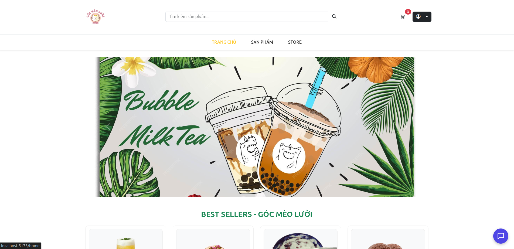  
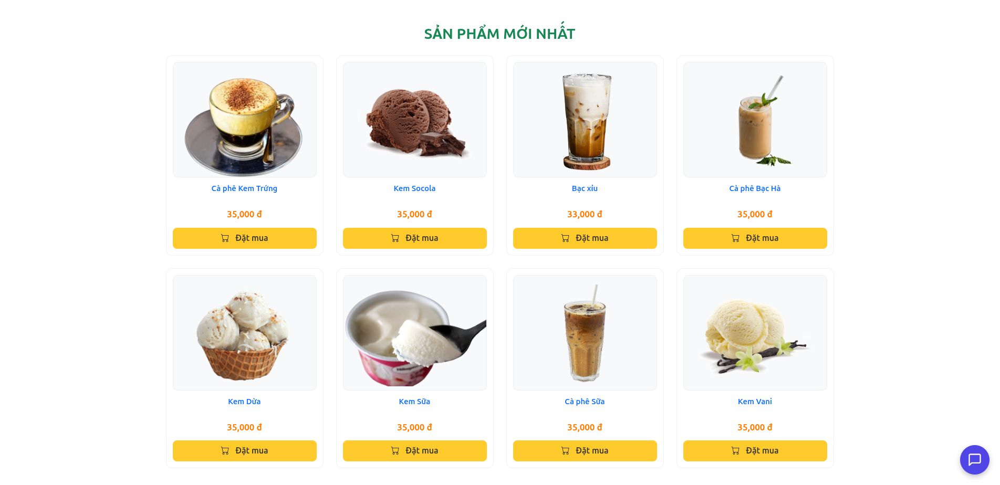

- Landing page with featured and new products, and quick access to main categories.

### 🛍 Product listing & detail

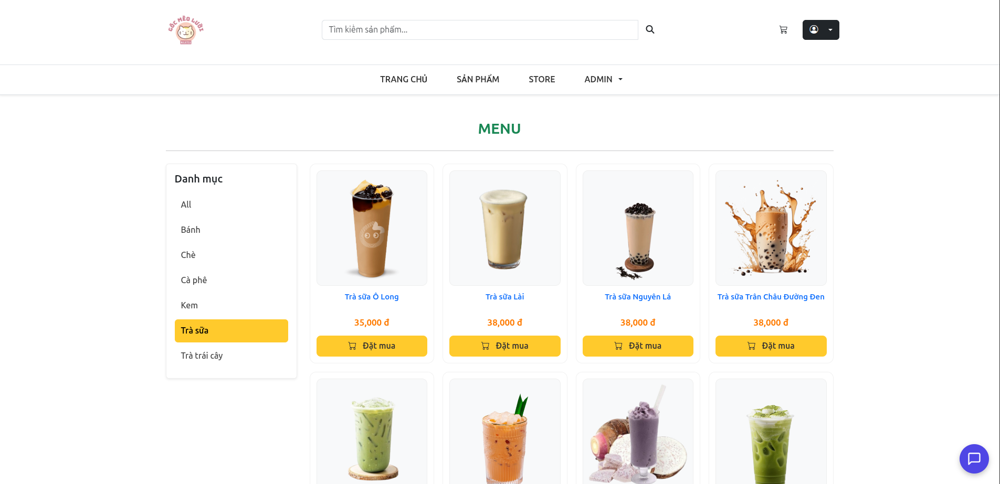  
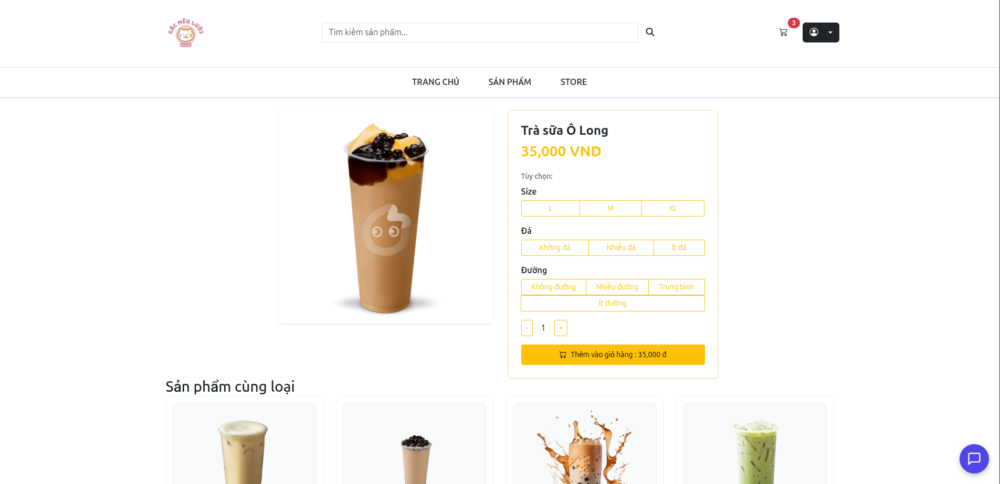

- Browse products by category, search and sort results.
- View full product details (description, price, options, images).

### 🧺 Cart & Checkout

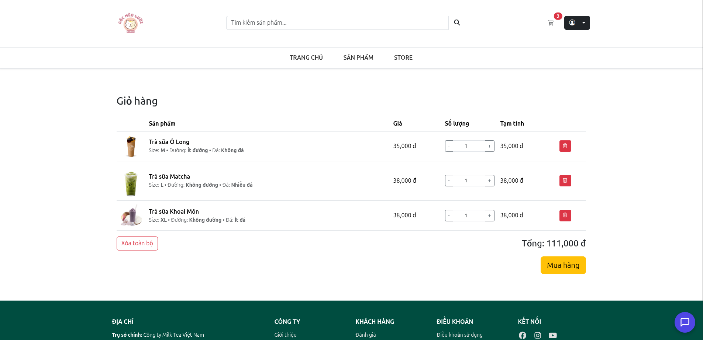  
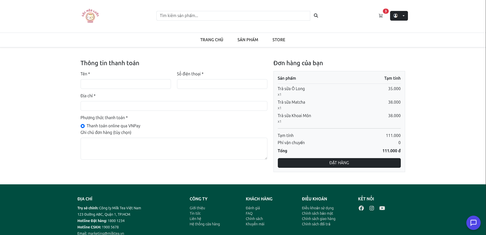  
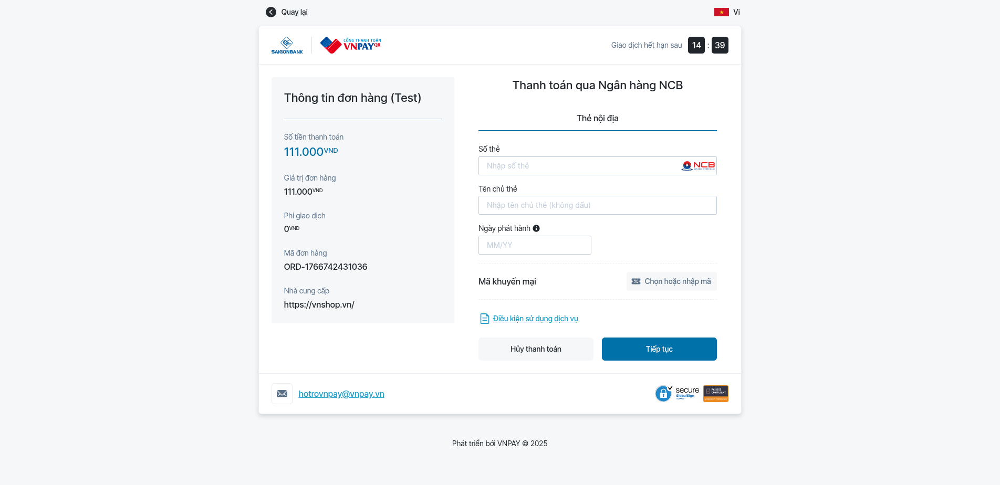

- Review cart items, update quantities and remove products.
- Choose shipping address and payment method (COD / VNPay) and place an order.

### 🛠 Admin – Categories & Products

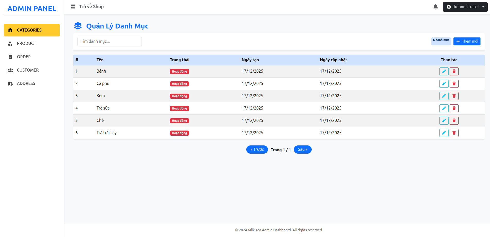  
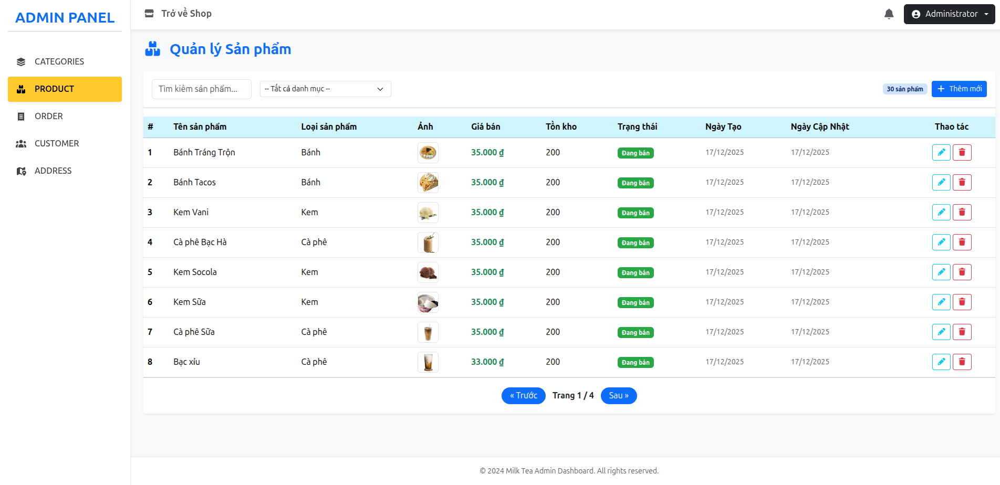

- Admin panel to manage categories and products (full CRUD, search and filter).

### 📦 Admin – Orders & Customers

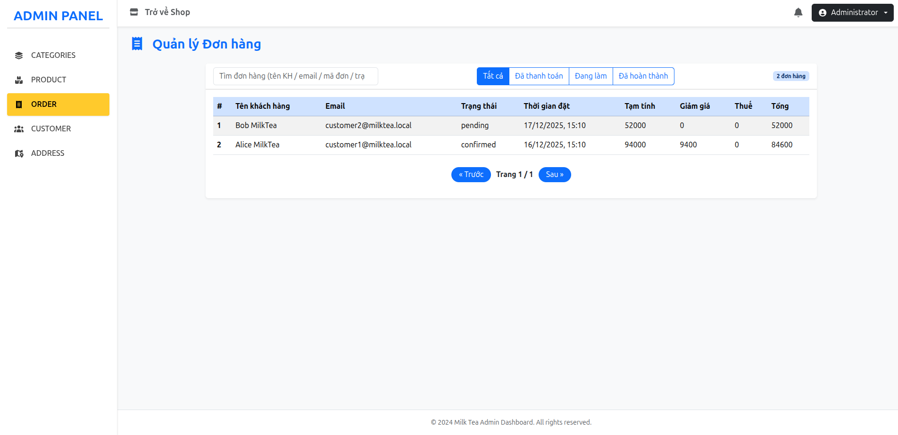  
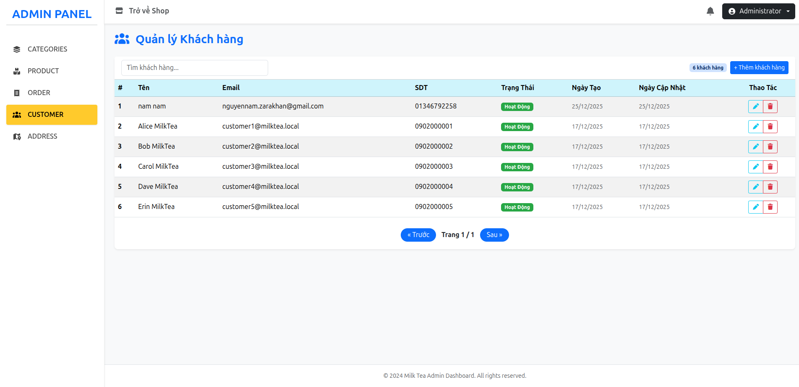

- Track orders and update statuses.
- View customer list and basic profile information to support order handling.

---

## 📊 Sample Data

The database comes with sample data for demo:

- Product categories and products for the shop.
- Demo customers and one admin account.
- Sample orders to showcase the admin dashboard.

---

## 🎓 Academic Information

- **Course**: Java Programming
- **Institution**: FPT Polytechnic
- **Assignment**: Milktea Website Development
- **Semester**: Fall 2025
- **Instructor**: Dev-Storm

---

## 👥 Project Team

**Milk Tea E-commerce Team (5 Full Stack Developers)**

- **Nam**  – https://github.com/Shinx99  
- **Vũ** – https://github.com/AnhVu-Josep 
- **Vương** – https://github.com/BuiHoangVuong777
- **Hải** – https://github.com/NgocHai112 
- **Trung** – https://github.com/HoangTrung2004 

---

## 📞 Contact & Support

- **Developer**: Dev-Storm
- **Email**: [picatssnam@gmail.com](mailto:picatssnam@gmail.com)

---

I hope this project helps you learn something valuable and grow your career in software development, and I also look forward to receiving your feedback and suggestions to keep improving this project. Thank you very much for your support.
