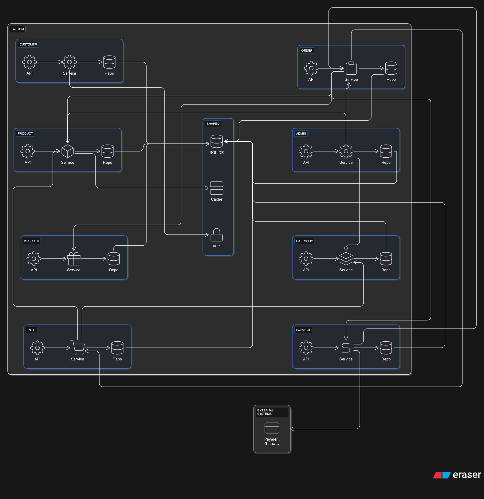

# E‑Commerce Feature‑Based Architecture

This Spring Boot monolith is organized by feature (vertical slice). Each feature contains its own API, Service, and Repository and shares common infrastructure such as SQL DB, Cache, and Auth. The diagram also shows an external Payment Gateway to clarify the system boundary.

## Scope and Boundary

- System: The whole e‑commerce application deployed as a single unit but structured by features for high cohesion and low coupling.
- External systems: The Payment Gateway is outside the System to make the third‑party dependency explicit.

## Core features

### Customer
- API: Endpoints for customer actions (browsing, profile, etc.).
- Service: Customer business logic (profile management, session, orchestration).
- Repo: Customer persistence.

### Product
- API: Read/write endpoints for products.
- Service: Product pricing and catalog rules.
- Repo: Product persistence.

### Category
- API: Category endpoints.
- Service: Classification logic and product assignment.
- Repo: Category persistence.

### Cart
- API: Cart operations.
- Service: Manage items and subtotal, talks to Product for price/stock.
- Repo: Cart persistence.

### Order
- API: Create and manage orders.
- Service: Build orders from cart, finalize price/stock, apply voucher, call payment.
- Repo: Order persistence.

### Payment
- API: Payment endpoints.
- Service: Create/settle transactions with the Payment Gateway (external).
- Repo: Payment persistence.

### Voucher
- API: Create/apply discount codes.
- Service: Validate conditions and compute discounts.
- Repo: Voucher persistence.

### Admin (Backoffice)
- API: Admin endpoints (catalog, orders, users, etc.).
- Service: Backoffice business workflows.
- Repo: Admin persistence.

### Shared
- SQL DB: Relational database shared by features.
- Cache: Speed up hot reads (for example, prices/stock).
- Auth: Authentication/authorization at the system edge.

## Main flows

- Intra‑feature: API → Service → Repository → SQL DB.
- Cart Service → Product Service: fetch item info/price/stock.
- Order Service → Cart Service: get items for checkout.
- Order Service → Product Service: verify stock and finalize price.
- Order Service → Voucher Service: apply discount code.
- Order Service → Payment Service: create payment request.
- Payment Service → Payment Gateway (external): execute transaction and update status.
- Admin Service → Product/Category/Order Services: backoffice operations.
- Customer Service → Auth: authentication and roles.

## Dependency rules

- Only Services call other Services; Repositories never call Services.
- Keep cross‑feature dependencies minimal and behind interfaces to ease future modularization.

## Why feature‑based?

- High cohesion within each slice and fewer cross‑package dependencies.
- Easier to evolve into a modular monolith or microservices if needed.
- Aligns with common Spring Boot practices for separating Controller, Service, and Repository layers.

## References

- This diagram was made with the useful support by **eraser.io**
