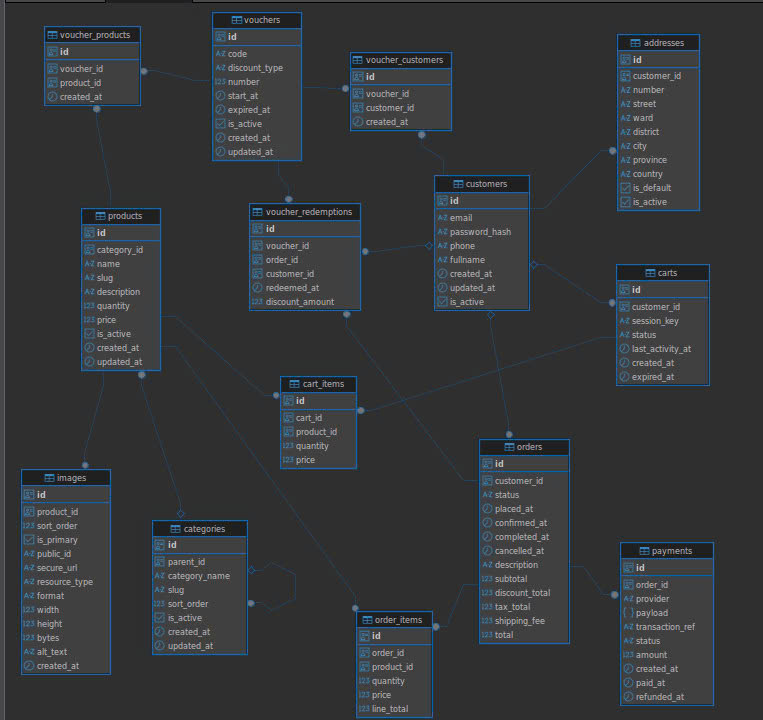

# E-commerce Database Schema Documentation

This system describes a database architecture for an e-commerce application, including main tables: `Users`, `Roles`, `Customers`, `Addresses`, `Products`, `Categories`, `Images`, `Carts`, `Cart_Items`, `Orders`, `Order_Items`, `Payments`, `Vouchers`, `Voucher_Products`, `Voucher_Customers`, and `Voucher_Redemptions`. These tables are linked through relationships to ensure data consistency and facilitate business operations.

## 1. Overview of Main Tables

- **Roles**: Stores role definitions for system users (id, role, description, created_at, updated_at, is_active).
- **Users**: Stores internal system user information (id, email, password_hash, role_id, created_at, updated_at, is_active).
- **Customers**: Stores customer information (id, email, password_hash, phone, fullname, created_at, updated_at, is_active).
- **Addresses**: Customer shipping/billing addresses (id, customer_id, number, street, ward, district, city, province, country, is_default, is_active).
- **Categories**: Product category hierarchy (id, parent_id, category_name, slug, sort_order, created_at, updated_at, is_active).
- **Products**: Product catalog (id, category_id, name, slug, description, quantity, price, created_at, updated_at, is_active).
- **Images**: Product images with metadata (id, product_id, sort_order, is_primary, public_id, secure_url, resource_type, format, width, height, bytes, alt_text, created_at).
- **Carts**: Shopping cart instances (id, customer_id, session_key, status, last_activity_at, created_at, expired_at).
- **Cart_Items**: Cart line items (id, cart_id, product_id, quantity, price).
- **Orders**: Customer orders (id, customer_id, status, placed_at, confirmed_at, completed_at, cancelled_at, description, subtotal, discount_total, tax_total, shipping_fee, total).
- **Order_Items**: Order line items with auto-calculated totals (id, order_id, product_id, quantity, price, line_total).
- **Payments**: Payment transactions (id, order_id, provider, payload, transaction_ref, status, amount, created_at, paid_at, refunded_at).
- **Vouchers**: Discount codes (id, code, discount_type, number, start_at, expired_at, created_at, updated_at, is_active).
- **Voucher_Products**: Product eligibility for vouchers (id, voucher_id, product_id, created_at).
- **Voucher_Customers**: Customer eligibility for vouchers (id, voucher_id, customer_id, created_at).
- **Voucher_Redemptions**: Voucher usage tracking (id, voucher_id, order_id, customer_id, redeemed_at, discount_amount).

## 2. Relationships in the Schema

### Roles - Users (Roles - Users)
- **Relationship**: One role can be assigned to multiple users (1-N).
- **Explanation**: System access control is managed through role assignments, with users.role_id referencing roles.id.

### Customers - Addresses (Customers - Addresses)
- **Relationship**: One customer can have multiple addresses (1-N).
- **Explanation**: Customers can maintain multiple shipping and billing addresses, with addresses.customer_id linking to customers.id. A partial unique index ensures only one address per customer can be marked as default.

### Categories - Categories (Parent-Child Categories)
- **Relationship**: One category can be the parent of multiple child categories (1-N).
- **Explanation**: Creates a hierarchical tree structure for product organization using parent_id self-reference, with constraint preventing self-reference.

### Categories - Products (Categories - Products)
- **Relationship**: One category contains multiple products; one product belongs to one category (1-N).
- **Explanation**: Products are classified under categories via products.category_id for catalog organization and navigation.

### Products - Images (Products - Images)
- **Relationship**: One product can have multiple images (1-N).
- **Explanation**: Product media assets are stored in images table with sort_order for display sequence and is_primary flag to designate the main product image. A partial unique index ensures only one primary image per product.

### Customers - Carts (Customers - Carts)
- **Relationship**: One customer has one active cart (1-1 for active carts).
- **Explanation**: Each customer or anonymous session maintains a single active cart tracked by customer_id or session_key. Partial unique indexes enforce one active cart per customer and one per session at any time.

### Carts - Cart_Items (Carts - Cart_Items)
- **Relationship**: One cart contains multiple cart items (1-N).
- **Explanation**: Cart_items stores product lines before checkout, linked via cart_id. A unique constraint on (cart_id, product_id) prevents duplicate product entries per cart.

### Products - Cart_Items (Products - Cart_Items)
- **Relationship**: One product can appear in multiple carts; one cart can contain multiple products (N-N).
- **Explanation**: The cart_items table serves as the junction for the many-to-many relationship between products and carts, capturing quantity and price snapshots.

### Customers - Orders (Customers - Orders)
- **Relationship**: One customer can place multiple orders (1-N).
- **Explanation**: Orders are linked to customers via orders.customer_id to track purchase history and customer activity.

### Orders - Order_Items (Orders - Order_Items)
- **Relationship**: One order contains multiple order items (1-N).
- **Explanation**: Order_items stores the purchased product lines with quantity and price. The line_total column is a generated stored column computed as quantity × price for consistency.

### Products - Order_Items (Products - Order_Items)
- **Relationship**: One product can appear in multiple orders; one order can contain multiple products (N-N).
- **Explanation**: The order_items table represents the many-to-many relationship between products and orders, preserving historical price and quantity data.

### Orders - Payments (Orders - Payments)
- **Relationship**: One order has one payment record (1-1).
- **Explanation**: Each order is coupled with a single payment record via payments.order_id for tracking payment lifecycle, provider details, and reconciliation data independently from order fulfillment.

### Vouchers - Products (Vouchers - Products)
- **Relationship**: One voucher can apply to multiple products; one product can be eligible for multiple vouchers (N-N).
- **Explanation**: Linked via voucher_products junction table to scope discount applicability to specific products. A unique constraint on (voucher_id, product_id) prevents duplicate entries.

### Vouchers - Customers (Vouchers - Customers)
- **Relationship**: One voucher can be assigned to multiple customers; one customer can have multiple vouchers (N-N).
- **Explanation**: Linked via voucher_customers junction table to restrict voucher eligibility to specific customers or customer segments. A unique constraint on (voucher_id, customer_id) prevents duplicate assignments.

### Vouchers - Orders (Vouchers - Orders via Redemptions)
- **Relationship**: One voucher can be redeemed on multiple orders; one order can use multiple vouchers (N-N tracked via redemptions).
- **Explanation**: The voucher_redemptions table logs each voucher application to an order, with a unique constraint on (voucher_id, order_id) enforcing one redemption per voucher per order to prevent duplicate discounts.

## 3. Explanation of Related Fields

- **Timestamps**: Fields like `created_at` and `updated_at` provide audit trails and data lifecycle tracking across all entities.
- **Status Fields**: Enum types for `order_status`, `payment_status`, and `cart_status` capture lifecycle states and enable workflow management.
- **Soft Deletes**: The `is_active` boolean flag enables logical deletion without removing historical records.
- **Generated Columns**: `line_total` in order_items is automatically computed from quantity × price using PostgreSQL's stored generated column feature for consistency.
- **Partial Indexes**: Conditional unique indexes enforce business rules like "one active cart per customer" and "one primary image per product" efficiently.
- **Junction Tables**: Many-to-many relationships use dedicated tables (cart_items, order_items, voucher_products, voucher_customers) with composite unique constraints.
- **Entity Separation**: Users/Roles are isolated from Customers to maintain security boundaries between system operators and shoppers, optimizing query patterns and access control.

## 4. Constraints and Indexing

### Primary Keys
- All tables use UUID primary keys generated via `gen_random_uuid()` for distributed system compatibility and security.

### Foreign Keys
- Child tables enforce referential integrity through foreign key constraints with appropriate ON DELETE behavior (CASCADE for dependent data, RESTRICT for critical references).

### Unique Constraints
- Composite uniqueness on junction tables prevents duplicate relationships.
- Email fields have unique constraints for authentication integrity.
- Slug fields use unique indexes for SEO-friendly URLs.

### Partial Unique Indexes
- `addresses(customer_id)` WHERE `is_default = true`: One default address per customer.
- `images(product_id)` WHERE `is_primary = true`: One primary image per product.
- `carts(customer_id)` WHERE `status = 'active'`: One active cart per customer.
- `carts(session_key)` WHERE `status = 'active'`: One active cart per anonymous session.

### Performance Indexes
- Foreign key columns are indexed to accelerate joins and lookups.
- Status and timestamp columns support common filtering patterns.
- Functional indexes like `lower(category_name)` enable case-insensitive uniqueness checks within category hierarchies.

### Check Constraints
- Numeric fields use CHECK constraints to enforce non-negative values for prices, quantities, and monetary amounts.
- Self-referential checks prevent categories from being their own parent.

## 5. Data Flow

1. **Account Creation**: Customers register with email/password; system users are created with role assignments.
2. **Browsing**: Products are organized in category hierarchies with images for display.
3. **Cart Management**: Anonymous or authenticated users add products to carts via cart_items.
4. **Checkout**: Active carts transition to orders with order_items capturing purchased products.
5. **Payment**: Payment records are created linked to orders, tracking gateway transactions.
6. **Voucher Application**: Eligible vouchers are redeemed and logged in voucher_redemptions.
7. **Order Lifecycle**: Order status progresses through pending → confirmed → shipped → completed with timestamp tracking.
8. **Payment Lifecycle**: Payment status tracks pending → authorized → paid → refunded states independently.

## 6. Operational Notes

### Inventory Management
- Stock levels are maintained in products.quantity.
- Inventory adjustments should be coordinated in application logic with transactional guarantees and row-level locking to prevent overselling.
- Consider implementing a stock_movements ledger table for audit trails and idempotent inventory operations.

### Voucher Enforcement
- Eligibility is checked against voucher_products and voucher_customers tables.
- Usage limits are enforced by counting voucher_redemptions records before allowing redemption.
- Application logic should validate voucher time windows (start_at, expired_at) and active status.

### State Machine Transitions
- Order and payment status transitions are best managed in application code with clear business rules.
- Database triggers can provide safety nets for critical invariants but should remain lightweight.
- Consider logging state changes in separate audit tables for compliance and debugging.

### Scalability Considerations
- Generated columns reduce computation at read time but add slight overhead on writes.
- Partial indexes minimize index size while enforcing conditional constraints.
- Junction tables enable flexible many-to-many relationships without schema changes.
- Consider archiving old cart_items, voucher_redemptions, and completed orders to separate historical tables.

### Security
- Separation of users and customers provides security boundaries.
- Password fields use hash storage (not plaintext).
- Payment payloads can store encrypted gateway responses for PCI compliance.
- Row-level security policies can further restrict data access based on customer_id.

## 7. Summary

This schema provides a comprehensive foundation for e-commerce operations including catalog management, shopping cart functionality, order processing, payment tracking, and flexible voucher systems. The design emphasizes data integrity through foreign keys, uniqueness constraints, and check constraints, while optimizing read performance with targeted indexes and generated columns. Separating concerns across normalized tables enables independent scaling and evolution of each domain module while maintaining referential consistency across the entire system.
