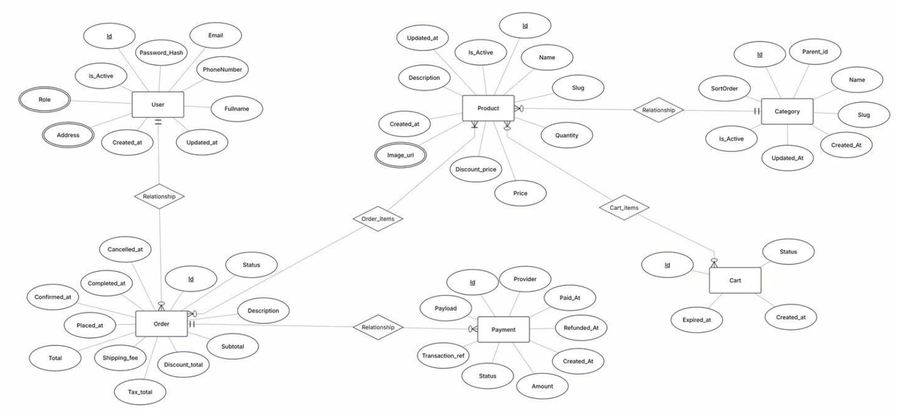

# Explanation of Relationships in the Sample DB System

This system describes a database architecture for an e-commerce application, including main tables: `User`, `Product`, `Category`, `Order`, `Payment`, and `Cart`. These tables are linked through relationships to ensure data consistency and facilitate business operations.

## 1. Overview of Main Tables

- **User**: Stores user information (id, email, password, phone, address, etc.).
- **Product**: Manages products (id, name, price, quantity, description, status, etc.).
- **Category**: Manages product categories (id, name, order, parent-child, etc.).
- **Order**: User orders (id, status, total amount, fees, etc.).
- **Payment**: Payment transactions (id, provider, amount, status, payment date, etc.).
- **Cart**: User shopping carts (id, status, creation date, expiration, etc.).

## 2. Relationships in the Schema

### User - Order (User - Order)
- **Relationship**: One user can have multiple orders (1-N).
- **Explanation**: When a user places an order, each order is linked to a specific user.

### Order - Payment (Order - Payment)
- **Relationship**: One order can be linked to one or more payments (1-N or 1-1 depending on business logic).
- **Explanation**: Each order includes payment details (success, refund, etc.) with related fields.

### Product - Category (Product - Category)
- **Relationship**: One product belongs to one or more categories; one category contains multiple products (N-N).
- **Explanation**: Linked via a junction table (relationship) for categorizing products into groups.

### Order - Product (Order - Product)
- **Relationship**: One order contains multiple products; one product can appear in multiple orders (N-N).
- **Explanation**: Linked via a junction table (Order_Items), which holds details like quantity and price per order.

### Product - Cart (Product - Cart)
- **Relationship**: One cart can contain multiple products; one product can be in multiple carts (N-N).
- **Explanation**: Linked via a junction table (Cart_Items) for managing selected products before purchase.

### Category - Category (Parent-Child Categories)
- **Relationship**: One category can be the parent of multiple child categories (1-N).
- **Explanation**: Creates a tree structure for hierarchical product categories.

## 3. Explanation of Related Fields

- Fields like `created_at`, `updated_at`, and `is_active` are used for data status control.
- Junction tables like `Order_Items` and `Cart_Items` handle N-N relationships, storing details such as product quantities, prices, etc., in orders or carts.
- Key fields: `price`, `quantity`, `discount_price`, and `status` manage product/order status, pricing, inventory, and promotions.

## 4. Summary

These relationships enable smooth system operation for e-commerce tasks like user management, product handling, categorization, ordering, and payments. Separating tables and using junction tables allows for easy scalability and efficient data control.
